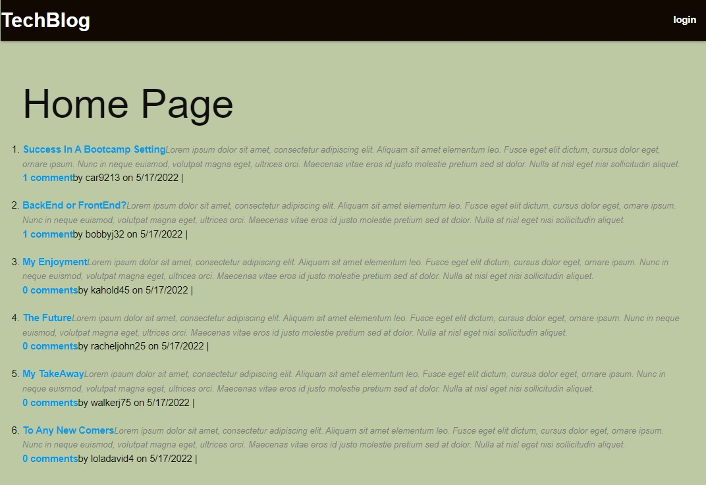

# Tech Blog MVC
    
  ## Description 
  A CMS-style blog site similar to a Wordpress site, where developers can publish their blog posts and comment on other developers’ posts as well.
  ## Table of Contents
  * [Installation](#installation)
  * [Usage](#usage)
  * [Screenshot](#screenshot)
  * [License](#license)  
  * [Questions](#questions)
  
  ## Installation 
  [Deployed Site](https://shielded-coast-79603.herokuapp.com/)
  ## Usage 
  You can follow the deployed link and start using it

  ## Screenshot 
  
  
  ## License 
  This project is license under [ISC](https://choosealicense.com/licenses/ISC/)

  ## Questions
  If you have any questions about this projects, please contact me directly at [c.vazquez1986@gmail.com](mailto:c.vazquez1986@gmail.com).  
  You can view more of my projects at [Clos86](https://github.com/Clos86).
